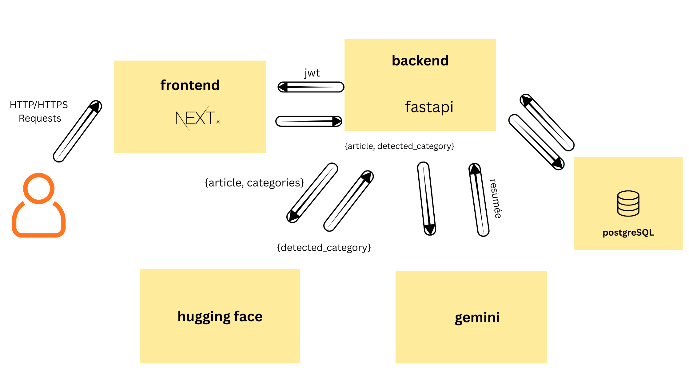

## Plateforme Fullstack Synthèse Contextuelle

* **Context Du Projets**


L’agence de media monitoring veut **automatiser l’analyse quotidienne de centaines d’articles** qui sont aujourd’hui traités **manuellement**, ce qui rend le travail **lent, coûteux, peu fiable**, et dépend fortement de l’expertise humaine pour **catégoriser et résumer** les contenus.

Pour améliorer ce processus, J'ai créer **une application full-stack interne**, sécurisée et facile à maintenir, capable de **piloter deux services d’IA externes** afin d’industrialiser l’analyse automatique des articles.


* **
## Structure du projet
 **📁Structure du Backend**

* `backend_Analyse_Synthese_Contextuelle_fullStack/`
    * `app/`  (Code source principal de l'application FastAPI)
        * `models/` (Définit la structure des tables de la base de données)
            * `synthese_logs.py`
            * `user.py/`
        * `routes/`  (Contient les définitions des endpoints de l'API)
             * `logging_config.py` 
             * `login.py`
             * `register.py`
             * `synthese.py`
             * `routes_journal.log` (Fichier journal pour stocker les logs d'activité spécifiques aux routes API)
        * `schemas/`  (Définit les modèles Pydantic pour la validation des données d'entrée et de sortie)
             * `analysis_logs_schema.py`
             * `user_schema.py`
        * `services/`  (Contient la logique métier complexe et les intégrations externes)
             * `auth_service.py`
             * `gemini_service.py`
             * `hugging_face_service.py`
             * `logging_config.py`
        * `tests/` (Contient les tests unitaires et d'intégration)
             * `test_gemini_service.py.py`
             * `test_hugging_face_service.py.py`
        * `database.py` (Gère la configuration et la connexion à la base de données)
        * `dependencies.py` (Fonctions d'injection de dépendances ( sessions DB))
        * `main.py` (Point d'entrée principal de l'application FastAPI)
    * `env/` (Variables d'environnement sensibles)
    * `.Dockerignore` (Règles d'ignorance pour Docker)
    * `.env` (Variables d'environnement sensibles)
    * `.gitignore` (Règles d'ignorance Git)
    * `Docker-compose.yml` (Orchestration Docker - API, DB, services)
    * `Dockerfile` (Image Docker du backend)
    * `pytest.ini` (Fichier de configuration pour le framework de test Pytest)
    * `requirements.txt` (Dépendances Python)

**📁Structure du Frontend**

`fronntend_Analyse_Contextuelle/`

   * `app/`  (Dossier principal du routeur Next.js, contenant les pages et le layout)
       * `Auth/` (Contient la logique des pages d'authentification (connexion et inscription))
            * `login/`
                   * `page.jsx`
            * `signup/`
                   * `page.jsx` 
        * `synthese/`  (Dossier pour la page d'analyse et de synthèse)
            * `page.jsx`
        * `global.css`  (Fichier pour définir les styles CSS globaux de l'application)
        * `layout.tsx`  (Le composant racine définissant la structure HTML globale et la mise en page)
        * `page.tsx`  (Le composant de la page d'accueil (index) de l'application)
   * `components/`  (Contient les composants d'interface utilisateur (UI) réutilisable.)
        * `global/`
            * `header.tsx`
            * `body.tsx`
   * `node_modules/`  (Dossier généré contenant toutes les dépendances Node.js du projet)
   * `public/`  (Dossier pour les fichiers statiques accessibles publiquement (images, favicons, etc.))
   * `.Dockerignore` (Règles d'ignorance pour Docker)
   * `.env` (Variables d'environnement sensibles)
   * `.gitignore` (Règles d'ignorance Git)
   * `Dockerfile` (Image Docker du backend)
   * `next.config.ts` (Fichier de configuration spécifique à Next.js)
   * `package-lock.json`  (Verrouille les versions exactes des dépendances Node.js installées)
   * `package.json`  (Fichier de configuration Node.js listant les dépendances et les scripts)
   * `readme.md` (Documentation principale du projet)
   * `next.config.ts` (Fichier de configuration de Next.js)

## Schéma d’architecture


## 🔃workflow de l'application

**Phase 1 : Authentification de l'Utilisateur**

1. Inscription et Hachage,L'utilisateur s'inscrit. Le mot de passe est haché en utilisant Argon2 et stocké dans PostgreSQL (user.py).

2. Connexion et Validation,"routes/login.py, services/auth_service.py",L'utilisateur se connecte. auth_service vérifie le mot de passe fourni par rapport au hash stocké via Argon2.

3. Génération de Token (JWT),services/auth_service.py → Frontend,"Si la validation réussit, auth_service génère un JWT (JSON Web Token) renvoyé au Frontend pour les requêtes futures."

**phase 2 : Acceder a l'endpoint d'analyse**

1. Vérification de la Présence du Token: Le Frontend envoie l'article/CV avec le JWT dans l'en-tête Authorization. dependencies.py vérifie sa présence.

2. Vérification du JWT et de l'Utilisateur: services/auth_service.py décode le JWT pour vérifier sa validité et extraire le username d'utilisateur autorisé.

3. Insertion des Données Brutes: Le routeur routes/synthese.py enregistre l'article brut et le username d'utilisateur dans la table synthese_logs.

**phase 3 : Traitement Ai et Stockage**

1. Traitement AI (Hugging Face): services/hugging_face_service.py : classifier le texte en une catégorie en utilisons l'api de hugging face.

2. Traitement AI (Gemini): ervices/gemini_service.py fait la synthèse contextuelle et l'analyse complexe si la synthese est positive , neutre ou négative.

3. Mise à Jour et Finalisation: models/synthese_logs.py met à jour l'entrée dans la table synthese_logs avec les résultats finaux (synthèse, catégories).

## limites techniques liées à la double dépendance IA
L'utilisation de deux services AI distincts introduit des défis importants :

Latence Accrue : Le temps de traitement total est la somme des temps d'inférence de Hugging Face et de Gemini.

Fiabilité et Gestion d'Erreurs : Une défaillance de l'une des deux API entraîne l'échec de la tâche complète, nécessitant une gestion robuste des rétries (retries) dans le Worker.

Coût/Infrastructure : Gestion des coûts d'API (Gemini) et/ou de l'infrastructure d'hébergement (Hugging Face).

##

# 🚀 Instructions de Lancement du Projet

## Prérequis

Avant de commencer, assurez-vous d'avoir installé :

-  **Docker** (version 20.10+)
-  **Docker Compose** (version 2.0+)
- **Git**

---

## 🔧 Installation et Configuration

### 1. Cloner les Dépôts GitHub 

#### Cloner le Backend et le Frontend

```bash
git clone https://github.com/Maryemelb/backend_Analyse_Synthese_Contextuelle_fullStack.git

git clonehttps://github.com/Maryemelb/frontend_analyse_synthese_contextuelle_fullstack.git
```

### 2. Configuration de l'Environnement

#### Backend - Créer le fichier `.env`

Dans le dossier `Backend_Traduction_Securisee_fullstack`, créez un fichier `.env` :


Ajoutez les variables d'environnement suivantes 

```env
# Database Configuration
DATABASE_NAME= synthese_textuel
DATABASE_PASSWORD= xxxx
DATABASE_USER=db_user
DATABASE_HOST=localhost
DATABASE_PORT=XXXX
jwt_secret= "xxxxxxxxxxxxxx"
ALGORITHM="HS256"

HF_TOKEN="xxxxxxxxxxxxxxxxxxxxxxxxx"
HUGGING_FACE_API= "xxxxxxxxxxxxxxxxxx"
HUGGING_FACE_API_TON= "xxxxxxxxxx"

GEMINI_API="xxxxxxxxxxxxxxxxx"

PORT= 8000
```

#### Frontend - Créer le fichier `.env`

Ajoutez :

```env
NEXT_PUBLIC_API_URL=http://localhost:8000
```

---

## 🐳 Démarrage avec Docker

### Option 1 : Utiliser Docker Compose 

#### Depuis la racine du projet backend

```bash
docker-compose up --build
```


## Accès aux Services

Une fois les conteneurs démarrés, les services seront disponibles aux adresses suivantes :

| Service | URL | Description |
|---------|-----|-------------|
| **Backend API** | http://localhost:8000 | API FastAPI |
| **API Documentation** | http://localhost:8000/docs | Swagger UI interactif |
| **Frontend** | http://localhost:3000 | Interface utilisateur Next.js |
| **Database** | `localhost:5432` | PostgreSQL (si configurée) |

---


